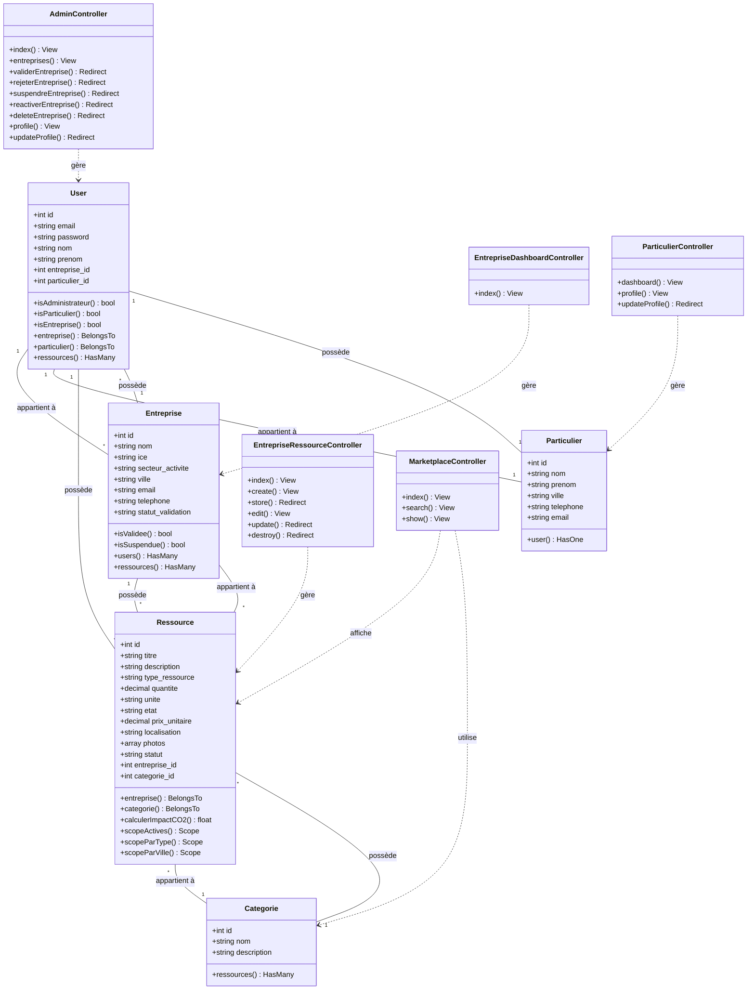

# Plateforme Kif-Kif - Diagramme de Classes

## Légende

**Cardinalités :**
- **"1"** : Exactement une instance
- **"*"** : Zéro ou plusieurs instances
- **"0..1"** : Zéro ou une instance

**Types de relations :**
- **--** : Association (relation simple entre classes, typique des clés étrangères en base de données)
- **..>** : Dépendance/Utilisation (un contrôleur dépend d'un modèle)

**Modificateurs d'accès :**
- **+** : Attribut/méthode public
- **-** : Attribut/méthode privé
- **#** : Attribut/méthode protégé

**Note :** Les relations d'agrégation (`o--`) et de composition (`*--`) ne sont pas utilisées car les relations Eloquent de Laravel sont basées sur des clés étrangères et ne représentent pas des relations de cycle de vie UML strictes.
