# Plateforme Kif-Kif - Diagramme des Cas d'Utilisation

```mermaid
flowchart TD
    %% Acteurs
    Visitor((Visiteur))
    Particulier((Particulier))
    Entreprise((Entreprise))
    Admin((Admin))

    %% Système Kif-Kif
    subgraph System["Plateforme Kif-Kif"]
        UC1[Connexion]
        UC2[Inscription Entreprise]
        UC3[Inscription Particulier]
        UC4[Déconnexion]
        UC5[Parcourir Ressources]
        UC6[Rechercher Ressources]
        UC7[Filtrer par Catégorie]
        UC8[Voir Détails Ressource]
        UC9[Créer Ressource]
        UC10[Modifier Ressource]
        UC11[Supprimer Ressource]
        UC12[Gérer Mes Ressources]
        UC13[Voir Profil]
        UC14[Mettre à Jour Profil]
        UC15[Voir Tableau de Bord]
        UC16[Voir Toutes Entreprises]
        UC17[Valider Entreprise]
        UC18[Rejeter Entreprise]
        UC19[Suspendre Entreprise]
        UC20[Réactiver Entreprise]
        UC21[Supprimer Entreprise]
        UC22[Mettre à Jour Profil Admin]
    end

    %% Relations Visiteur
    Visitor --> UC5
    Visitor --> UC6
    Visitor --> UC7
    Visitor --> UC8
    Visitor --> UC2
    Visitor --> UC3

    %% Relations Particulier
    Particulier --> UC1
    Particulier --> UC4
    Particulier --> UC5
    Particulier --> UC6
    Particulier --> UC7
    Particulier --> UC8
    Particulier --> UC13
    Particulier --> UC14
    Particulier --> UC15

    %% Relations Entreprise
    Entreprise --> UC1
    Entreprise --> UC4
    Entreprise --> UC5
    Entreprise --> UC6
    Entreprise --> UC7
    Entreprise --> UC8
    Entreprise --> UC9
    Entreprise --> UC10
    Entreprise --> UC11
    Entreprise --> UC12
    Entreprise --> UC13
    Entreprise --> UC14
    Entreprise --> UC15

    %% Relations Admin
    Admin --> UC1
    Admin --> UC4
    Admin --> UC13
    Admin --> UC14
    Admin --> UC15
    Admin --> UC16
    Admin --> UC17
    Admin --> UC18
    Admin --> UC19
    Admin --> UC20
    Admin --> UC21
    Admin --> UC22

    %% Styles
    classDef actor fill:#e1f5fe,stroke:#01579b,stroke-width:3px
    classDef usecase fill:#fff3e0,stroke:#e65100,stroke-width:2px
    classDef system fill:#fafafa,stroke:#333,stroke-width:3px

    class Visitor,Particulier,Entreprise,Admin actor
    class UC1,UC2,UC3,UC4,UC5,UC6,UC7,UC8,UC9,UC10,UC11,UC12,UC13,UC14,UC15,UC16,UC17,UC18,UC19,UC20,UC21,UC22 usecase
    class System system
```

## Légende

**Éléments :**
- **(( ))** : Acteur (cercle bleu)
- **[ ]** : Cas d'utilisation (rectangle orange)
- **Rectangle principal** : Système Kif-Kif

**Acteurs (4) :**
- **Visiteur** : Utilisateur non authentifié
- **Particulier** : Compte utilisateur individuel
- **Entreprise** : Compte entreprise/société
- **Admin** : Administrateur de la plateforme

**Cas d'utilisation (22) :**
- **Authentification** : Connexion, Inscription, Déconnexion
- **Marketplace** : Parcourir, Rechercher, Filtrer, Voir détails
- **Gestion des Ressources** : Créer, Modifier, Supprimer, Gérer
- **Gestion des Utilisateurs** : Voir profil, Mettre à jour, Tableau de bord
- **Fonctions Admin** : Gestion complète des entreprises
